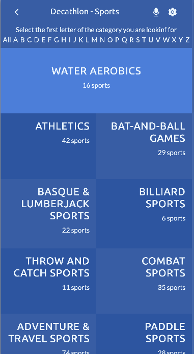

# Space travellers
> This page is a page made for mobiles where you can see a lot of sports by category that are taken from an API.

# Live demo
You can see my page live [here](https://disc3110.github.io/sports-capstone)

# Video Description
[video link](https://www.loom.com/share/8db1b95a5fff439e8d7f2d135cb089db)

# Screenshots


## Built With
- React
- Redux
- Bootstrap
- css3

## Getting Started
To get a local copy follow the following steps !
- open your terminal 
- clone this repo `git clone https://github.com/disc3110/sports-capstone.git`
- go to the repo `cd sports-capstone`
- Install the packages with npm `npm install`
- use `npm run start` to build dist files and run local server

### Testing

1. Run the tests
   ```sh
   npm test
   ```
   or
   ```sh
   npm run watch
   ```
2. See report in browser 
   ```sh
   open ./coverage/lcov-report/index.html
   ```
## Authors

👤 *Diego Solis*

- GitHub: [@disc3110](https://github.com/disc3110)
- Twitter: [@disc3110](https://twitter.com/disc3110)


## 🤝 Contributing

Contributions, issues, and feature requests are welcome!

Feel free to check the [issues page](https://github.com/disc3110/sports-capstone/issues).

## Show your support

Give a ⭐️ if you like this project!

## Acknowledgments
This project was made fllowing [Nelson Sakwa](https://www.behance.net/gallery/31579789/Ballhead-App-(Free-PSDs)) design

## 📝 License

This project is [MIT](./MIT.md) licensed.
